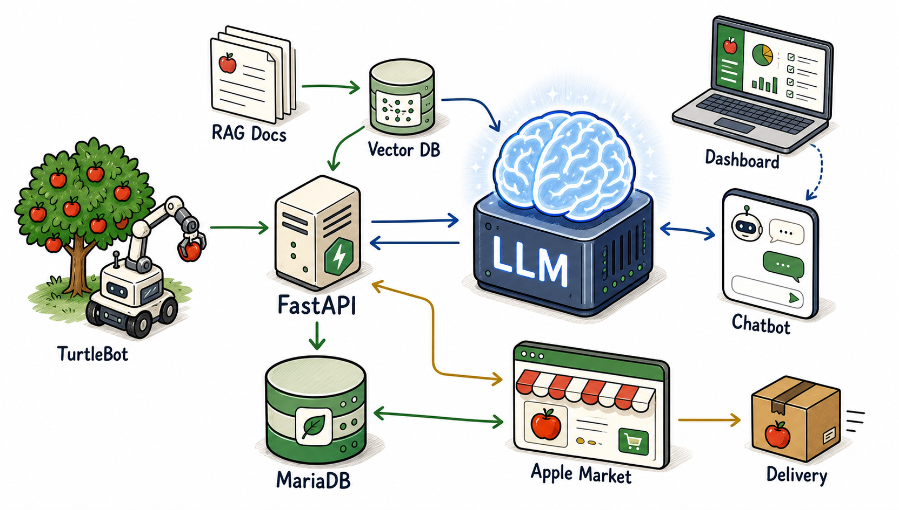

# Harvest to sale

수확 로봇이 수집한 사과 품질·수확 데이터를 판매 관리 시스템과 연결하고, RAG 기반 AI 도우미가 재고 조회, 판매 등록, 시세 예측, 뉴스 요약, 판매 전략 판단을 지원하는 스마트 농산물 판매 관리 MVP입니다.

농가 인구 감소와 고령화로 수확 이후의 재고 관리, 온라인 판매 등록, 주문 확인까지 사람이 직접 처리하기 어려워지고 있습니다. 이 프로젝트는 **수확 → 품질 분류 → DB 적재 → AI 판매 판단 → 판매 페이지 등록 → 주문 관리** 흐름을 하나의 서비스로 연결하는 것을 목표로 합니다.

## 주요 기능

- TurtleBot/로봇팔 수확 결과를 FastAPI로 수신하고 DB에 저장
- 사과 크기와 품질 등급 기준 재고 관리
- 관리자 대시보드에서 재고, 판매 상품, 주문, 알림 확인
- 판매자 페이지에서 상품 필터링, 주문 수량 조절, 구매 기록 조회
- RAG 문서 기반 AI 도우미
- 가락시장 사과 가격 데이터 기반 시계열 예측 리포트 생성
- Google News RSS 기반 과일 수급·가격 뉴스 요약 문서 생성
- MariaDB Vector Search 기반 문서 검색
- Basic(Local LLM) / Pro(Server-Based LLM) 이중 구성
- Docker Compose 기반 컨테이너 배포 구조

## 시스템 구조



RAG 문서는 `rag_docs/`의 Markdown 파일을 chunk 단위로 분할한 뒤 임베딩 벡터로 변환하여 MariaDB의 `rag_documents` 테이블에 저장합니다. 사용자의 질문도 임베딩한 뒤 `VEC_DISTANCE_COSINE()` 기반 Vector Search로 관련 문서를 찾고, 검색 결과를 LLM 프롬프트에 포함해 답변을 생성합니다.

## Basic vs Pro

| 구분 | Basic version | Pro version |
|---|---|---|
| LLM | Local LLM | Server-Based LLM |
| 답변 모델 | Ollama Qwen 2.5 | GPT-4o mini |
| 임베딩 | bge-m3 | OpenAI Embedding |
| DB | MariaDB | MariaDB Container |
| 실행 방식 | 로컬 PC / Docker Compose | Docker Compose |
| 장점 | 데이터 외부 전송 최소화, 네트워크 독립성, API 비용 절감 | 높은 응답 품질, 빠른 응답, 모델 교체와 확장 용이 |

Basic은 로컬 PC에서 실행 가능한 구조이고, Pro는 OpenAI API를 사용해 답변 품질과 확장성을 높인 구조입니다. 두 버전 모두 같은 애플리케이션 코드와 RAG 문서 구조를 공유합니다.

## 기술 스택

| 영역 | 기술 |
|---|---|
| Backend | FastAPI |
| Frontend | Streamlit |
| Database | MariaDB 11.8 |
| Vector Search | MariaDB Vector, `VECTOR`, `VEC_DISTANCE_COSINE()` |
| RAG | Markdown chunking, embedding, vector retrieval |
| Local LLM | Ollama, Qwen 2.5 |
| Pro LLM | OpenAI GPT-4o mini |
| Embedding | bge-m3, text-embedding-3-small |
| Price Forecast | Chronos mini |
| Deploy | Docker Desktop, Docker Compose |

## 프로젝트 구조

```text
app/
  api/        FastAPI 라우터
  db/         MariaDB 연결, 스키마, 재고/판매/인증/벡터 검색
  llm/        Ollama/OpenAI 호출 로직
  news/       뉴스 수집 및 RAG 문서 갱신
  prices/     가락시장 가격 데이터 수집 및 예측 문서 갱신
  rag/        문서 ingest, embedding, retriever, prompt builder
  ui/         Streamlit 관리자/판매 페이지

HW_control/   ROS2 기반 TurtleBot/로봇팔 수확 제어 코드
rag_docs/     RAG 지식 문서
fruits_data/  가격 데이터 원본 및 CSV
editions/
  free/       Basic Docker 구성
  pro/        Pro Docker 구성
reviews/      LLM 평가 결과 및 리뷰 문서
scripts/      실행, 벤치마크, 이미지 생성 보조 스크립트
output/       발표/README용 산출 이미지
```

## 실행 방법

### 1. Basic version 실행

Basic Docker 구성은 FastAPI, MariaDB, 관리자 페이지, 판매 페이지를 컨테이너로 실행합니다. Ollama는 호스트 PC에서 실행되어야 합니다.

```powershell
Copy-Item editions\free\.env.example .env
$env:FREE_API_PORT='8001'
docker compose --env-file .env -f editions/free/docker-compose.free.yml up -d --build
```

접속 주소:

```text
Basic Admin: http://127.0.0.1:8501
Basic Shop:  http://127.0.0.1:8502
Basic API:   http://127.0.0.1:8001/health
```

### 2. Pro version 실행

Pro 버전은 OpenAI API 키가 필요합니다.

```powershell
Copy-Item editions\pro\.env.pro.example editions\pro\.env.pro
```

`editions/pro/.env.pro`에 OpenAI API 키와 DB 비밀번호를 설정합니다.

```env
OPENAI_API_KEY=...
OPENAI_CHAT_MODEL=gpt-4o-mini
OPENAI_EMBEDDING_MODEL=text-embedding-3-small
```

실행:

```powershell
docker compose --env-file editions/pro/.env.pro -f editions/pro/docker-compose.pro.yml up -d --build
```

접속 주소:

```text
Pro Admin: http://127.0.0.1:8601
Pro Shop:  http://127.0.0.1:8602
Pro API:   http://127.0.0.1:8000/health
```

### 3. 컨테이너 상태 확인

```powershell
docker ps
docker compose --env-file editions/pro/.env.pro -f editions/pro/docker-compose.pro.yml logs -f api
```

## 기본 계정

| 버전 | 역할 | ID | Password |
|---|---|---|---|
| Basic | 관리자 | `admin` | `admin1234` |
| Basic | 고객 | `customer` | `customer1234` |
| Pro | 관리자 | `adminpro` | `adminpro1234` |
| Pro | 고객 | `customerpro` | `customerpro1234` |

## RAG 지식 베이스

현재 RAG는 다음 문서를 기반으로 구성됩니다.

- `rag_docs/apple_price_forecast_chronos_mini.md`
- `rag_docs/fruit_news_2026.md`
- `rag_docs/fruit_suppliers.md`
- `rag_docs/fruit_price_inventory_sales.md`
- `rag_docs/sample_fruit_policy.md`

문서 갱신 후 재적재:

```powershell
python -m app.rag.ingest_docs
```

Pro Docker 구성에서는 API 컨테이너 시작 시 스키마 초기화와 RAG 문서 적재가 자동으로 실행됩니다.

## AI 도우미 흐름

```text
사용자 질문
→ 질문 임베딩
→ MariaDB Vector Search로 관련 RAG chunk 검색
→ 검색 결과와 질문을 조합해 프롬프트 생성
→ LLM 답변 생성
→ 관리자 대시보드에 응답 표시
```

재고 조회, 수확 기록 조회처럼 DB에서 바로 답할 수 있는 질문은 FastAPI가 직접 처리하고, 판매 전략·시세 판단·뉴스 요약처럼 추론이 필요한 질문은 RAG 검색 결과를 LLM에 전달합니다.

## 하드웨어 제어 코드

`HW_control/apple_harvest.py`는 ROS2 기반 수확 제어 노드입니다.

- NCNN 객체 탐지 모델로 사과 상태를 탐지
- ArUco 마커와 depth 카메라를 이용해 정렬 및 3D 좌표 계산
- MoveIt2와 gripper action으로 로봇팔 수확 동작 수행
- 품질 등급과 크기 정보를 FastAPI `/robot/harvest` 엔드포인트로 전송
- `HARVEST_API_URL` 환경변수로 백엔드 서버 주소 변경 가능

## 가격 예측 리포트

가격 예측 리포트는 LLM의 판매 적정 시기 판단을 돕기 위한 보조 지식입니다.

- 가락시장 사과 거래 가격 데이터 수집
- Chronos mini 기반 시계열 예측
- 예측 결과를 Markdown 문서로 생성
- 생성된 문서를 RAG에 적재

관련 코드:

```text
app/prices/garak_crawler.py
app/rag/generate_apple_forecast_doc.py
app/prices/refresh.py
```

## LLM 성능 평가

LLM 답변 평가는 단순 DB 조회성 질문을 제외하고, 실제 LLM이 개입하는 질문 100개를 기준으로 수행했습니다.

| 지표 | Basic Local | Pro OpenAI |
|---|---:|---:|
| 답변 관련성 | 0.927 | 0.983 |
| 충실도 | 0.872 | 0.903 |
| 환각률 | 0.034 | 0.020 |
| 한국어 품질 | 0.965 | 1.000 |
| 평균 응답 시간 | 5.05초 | 3.19초 |
| LLM 답변 품질 점수 | 0.932 | 0.967 |

평가 결과는 두 모델 모두 실사용 가능한 수준이었고, Pro 버전이 답변 품질과 응답 시간에서 더 우세했습니다.

## Docker 기반 배포 전략

초기 개발 단계에서는 클라우드 서버 비용 부담으로 인해 Docker Desktop이 설치된 로컬 PC를 임시 서버로 활용했습니다. Docker Compose를 통해 FastAPI, MariaDB, Streamlit 관리자 페이지, 판매 페이지를 독립 컨테이너로 분리했기 때문에 같은 네트워크 안에서는 PC IP로 접속할 수 있습니다.

추후 AWS, GCP, Oracle Cloud 같은 클라우드 서버를 확보하면 현재 컨테이너 구조를 그대로 이전해 외부 서비스로 확장할 수 있습니다.

## 차별성

- 자동 수확 로봇 데이터와 판매 관리 시스템을 하나의 파이프라인으로 연결
- 수확된 사과를 개별 단위로 기록하고 FIFO 기반 재고 관리
- 판매 상품 등록, 주문, 구매 기록까지 웹 페이지에서 처리
- RAG 기반 AI 도우미로 시세·뉴스·판매 전략 판단 지원
- 별도 벡터 DB 없이 MariaDB에서 정형 데이터와 벡터 검색을 함께 처리
- Basic/Pro 버전으로 로컬 운영과 서버 기반 LLM 운영을 모두 지원

## 향후 계획

- 클라우드 서버 배포 및 외부 접속 확장
- 실제 농가 데이터 기반 가격 예측 및 판매 전략 모델 고도화
- 자동 수확 로봇과 판매 등록 흐름의 실시간 연동 강화
- 농가 사용자를 위한 UI/UX 디자인 개선

