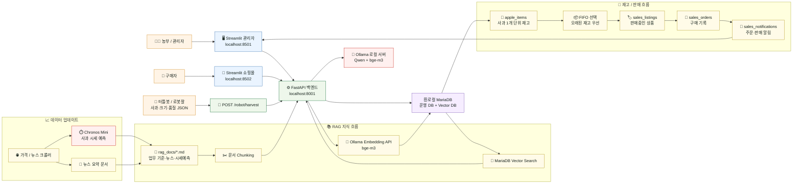

# 시스템 아키텍처

## 무료 버전: 로컬 LLM / 온디바이스 구조

무료 버전은 인터넷 없이도 로컬 PC 안에서 돌아가는 구조다. Ollama가 LLM과 임베딩을 담당하고, MariaDB가 운영 DB와 Vector DB 역할을 함께 맡는다.

## Pro 버전: GPT API / Docker 서버 구조

```mermaid
flowchart LR
    farmer["👨‍🌾 농부 / 관리자"] --> pro_admin["🖥️ Streamlit Pro 관리자<br/>server:8601"]
    buyer["🛒 구매자"] --> pro_shop["🍎 Streamlit Pro 쇼핑몰<br/>server:8602"]
    robot["🤖 터틀봇 / 로봇팔<br/>사과·크기·품질 JSON"] --> pro_harvest["📡 POST /robot/harvest"]

    pro_admin --> pro_api["⚙️ FastAPI 백엔드<br/>server:8000"]
    pro_shop --> pro_api
    pro_harvest --> pro_api

    pro_api --> pro_db["🗄️ MariaDB 서버 / 컨테이너<br/>운영 DB + Vector DB"]
    pro_api --> openai["🧠 OpenAI API<br/>GPT + Embedding"]

    subgraph rag_pro["📚 RAG 지식 흐름"]
        pro_docs["📄 rag_docs/*.md<br/>업무 기준·뉴스·시세예측"]
        pro_chunk["✂️ 문서 Chunking"]
        pro_embed["🧩 OpenAI Embedding API"]
        pro_vector["🔎 MariaDB Vector Search"]
    end

    pro_docs --> pro_chunk
    pro_chunk --> pro_api
    pro_api --> pro_embed
    pro_embed --> pro_db
    pro_db --> pro_vector --> pro_api

    subgraph inventory_pro["🍏 재고 / 판매 흐름"]
        pro_items["🍎 apple_items<br/>사과 1개 단위 재고"]
        pro_fifo["📦 FIFO 선택<br/>오래된 재고 우선"]
        pro_listings["🏷️ sales_listings<br/>판매중인 상품"]
        pro_orders["🧾 sales_orders<br/>구매 기록"]
        pro_alerts["🔔 sales_notifications<br/>주문·판매 알림"]
    end

    pro_db --> pro_items --> pro_fifo --> pro_listings --> pro_orders --> pro_alerts
    pro_alerts --> pro_admin

    subgraph update_pro["📈 데이터 업데이트"]
        pro_crawler["🌐 가격 / 뉴스 크롤러"]
        pro_chronos["⏱️ Chronos Mini<br/>사과 시세 예측"]
        pro_news["📰 뉴스 요약 문서"]
    end

    pro_crawler --> pro_chronos --> pro_docs
    pro_crawler --> pro_news --> pro_docs

    classDef user fill:#fff4e6,stroke:#d28b22,color:#17231d,stroke-width:1px;
    classDef ui fill:#eaf4ff,stroke:#3f78b5,color:#17231d,stroke-width:1px;
    classDef api fill:#eef7eb,stroke:#16713a,color:#17231d,stroke-width:1px;
    classDef db fill:#f6edff,stroke:#7d5bb7,color:#17231d,stroke-width:1px;
    classDef ai fill:#fff0ef,stroke:#c9281f,color:#17231d,stroke-width:1px;
    classDef data fill:#fffbe8,stroke:#b59b26,color:#17231d,stroke-width:1px;

    class farmer,buyer,robot user;
    class pro_admin,pro_shop ui;
    class pro_api,pro_harvest api;
    class pro_db db;
    class openai,pro_chronos ai;
    class pro_docs,pro_chunk,pro_embed,pro_vector,pro_crawler,pro_news,pro_items,pro_fifo,pro_listings,pro_orders,pro_alerts data;
```

Pro 버전은 Docker Compose로 관리자, 쇼핑몰, API, DB를 나누고, LLM과 임베딩은 OpenAI API를 사용한다. 외부 접속이나 서버 배포를 고려할 때 이 구조가 기준이 된다.

## 무료 / Pro 차이 요약

| 구분 | 무료 버전 | Pro 버전 |
|---|---|---|
| 실행 위치 | 로컬 PC | Docker 기반 서버 |
| LLM | Ollama Qwen | OpenAI GPT API |
| Embedding | bge-m3 로컬 임베딩 | OpenAI Embedding |
| DB | 로컬 MariaDB | MariaDB 컨테이너 / 서버 DB |
| 목적 | 오프라인·온디바이스 데모 | 외부 접속·서비스형 데모 |
| 광고 | 표시 가능 | 표시하지 않음 |
